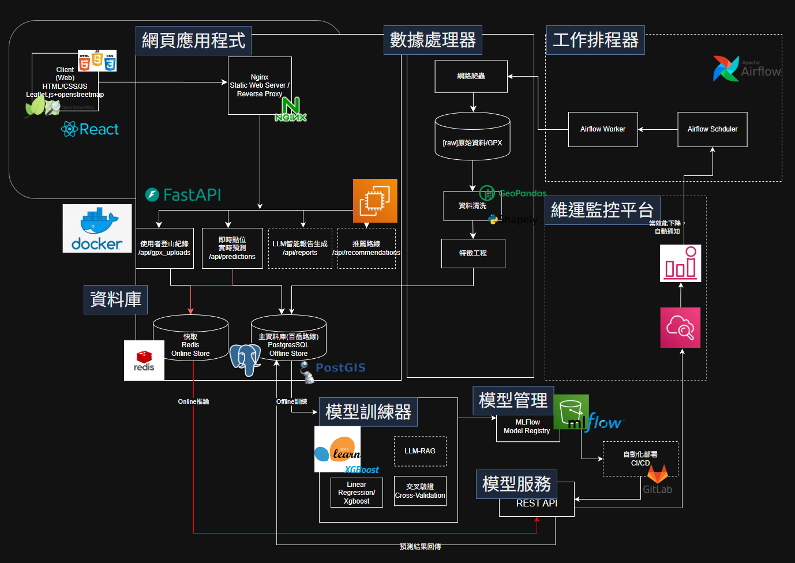

# Allpass - 登山時間預測系統 (Allpass - Hiking Time Prediction System)

本專案是一個端到端的 **AI 驅動登山時間預測平台**，結合 **前端應用、後端 API、資料庫、ETL 工作流、模型訓練與部署、監控平台**，完整實現 **模型生命週期 (ML Lifecycle)**。

目前專案主線：
-  核心功能：登山路線時間預測
-  架構演進：Flask → FastAPI (async, high throughput) 重構中
-  擴充方向：雲端部署、維運監控、推薦系統、LLM 個人化分析（規劃中）

---

## 系統架構



核心資料流：
* Offline(Batch / Training Path): 爬蟲 → 原始資料 (PostGIS) → 特徵工程 (GeoPandas) → 模型訓練 (XGBoost) → 註冊 (MLflow)
* Online(Serving Path): 使用者 (React) → Nginx → 預測API (Flask → FastAPI 重構中) → Redis 快取線上特徵 -> 推論服務 (FastAPI)  → 回傳預測

系統包含以下主要模組：

1. **前端應用 (Frontend Web App)**
   - 技術：React、Leaflet + OpenStreetMap + Nginx(Static Web Server / Reverse Proxy)
   - 功能：登山路線顯示、使用者上傳 GPX、查詢預測結果

2. **後端 API (Backend API)**
   - 技術：
      - Current: Flask + SQLAlchemy
      - Refactoring: FastAPI
   - 功能：
     - `/api/gpx_uploads`: 上傳 GPX 軌跡
     - `/api/predictions`: 即時路段時間預測

3. **資料庫 (Database Layer)**
   - PostgreSQL + PostGIS：地理空間資料存放 (登山路線、軌跡)
   - Redis：快取即時預測結果 (Online Store)
   - 初始化 SQL 位於 `db/init`

4. **ETL 與資料處理 (ETL Jobs & Data Processor)**
   - 技術：Airflow + BeautifulSoup + GeoPandas + Shapely
   - 功能：網路爬蟲、資料清洗、特徵工程
   - ETL 容器程式位於 `etl/`

5. **模型訓練與管理 (Model Lifecycle)**
   - 訓練 (`training/`)：支援 Scikit-learn、XGBoost
   - MLflow (`services/mlflow/`)：模型註冊、版本管理
   - 模型部署：REST API 容器化服務 (`aiservices/time_prediction`)

6. **維運監控平台 (Monitoring & Alerting)[規劃中]**
   - Metrics: Prediction Latency, RMSE Drift
   - Infra: AWS CloudWatch

---

## 模型生命週期 (ML Lifecycle)

專案完整實現 **從資料收集到模型服務化的生命週期**：

1. **資料收集 (Data Collection)**  
   - 爬蟲 + 使用者上傳 GPX  
   - 存放於 PostgreSQL + PostGIS  

2. **資料處理 (Data Processing)**  
   - ETL 工作流
   - 特徵工程 (GeoPandas, Shapely)  

3. **模型訓練 (Model Training)**  
   - Scikit-learn, XGBoost
   - Cross-validation  
   - Logging 至 MLflow  

4. **模型管理 (Model Management)**  
   - MLflow Model Registry  

5. **模型服務 (Model Serving)**  
   - REST API 容器化 (Docker + FastAPI)  
   - Redis 線上快取，降低查詢延遲

6. **維運監控平台 (Monitoring & Alerting)[規劃中]**
   - Metrics: Prediction Latency, RMSE Drift
   - Infra: AWS CloudWatch

---

## 專案目錄結構
```markdown
allpass/
├── aiservices/          # 線上 AI 推論服務（Model Serving）
│   ├── llm/             # 擴充功能:LLM個人化報表(規劃導入)
│   ├── recommendation/  # 擴充功能:推薦系統(規劃導入)
│   └── time_prediction/ # 登山時間預測模型 API
├── backend/             # 既有 Flask API（穩定版本）
├── backendf/            # FastAPI API（重構中，將取代 backend）  
├── common/              # 共用模組（config, schemas, utils）
├── db/                  # PostgreSQL / PostGIS 初始化與 schema
├── doc/                 # 系統設計與技術文件
├── etl/                 # 資料蒐集 / 清洗 / 特徵工程 (Jobs)
├── frontend/            # React前端
├── migrations/          # Alembic migrations
├── services/            # 外部服務整合（Airflow, MLflow, monitoring）
├── training/            # 模型訓練流程（offline）
├── alembic.ini 
├── docker-compose.yml
├── pytest.ini 
└── README.md
```

---

---

## 系統分層說明
```markdown
- 資料
  - etl/
  - db/
  - migrations/

- 模型生命週期
  - training/        # Model training
  - aiservices/      # Online inference / serving

- 應用
  - backend/         # Flask (current)
  - backendf/        # FastAPI (refactoring target)
  - frontend/

- Infra
  - services/         # MLOps & Orchestration (Airflow, MLflow, monitoring)
  - docker-compose.yml
```
這個專案採用 資料 → 模型 → 服務 → 前端 的分層設計，
目前正在將既有 Flask API 重構為 FastAPI，
並將 AI 模型訓練、推論與應用層明確拆分，
以利未來擴充推薦系統與 LLM 個人化分析功能。

---


## 快速啟動
> **Note**
> 本專案使用 **Docker Compose** 啟動多個服務，  
> 請確認以下 port 未被其他程式佔用：
>
> - 80      : Frontend (Nginx)
> - 5000    : Backend API (FastAPI)
> - 8000    : Model Inference Service
> - 5001    : MLflow UI
> - 5432    : PostgreSQL
> - 6379    : Redis
> - 9000    : MinIO Server (S3 API)
> - 9001    : MinIO Console

### 1. 建立與啟動環境
```markdown
git clone https://github.com/chihjolin/allpass.git
cd allpass
docker-compose up -d --build
```
> **說明**  
> --build：確保 Docker image 與 Dockerfile 同步  
> 第一次啟動時建議加上；Dockerfile 或 requirements 有變更時，必須加  
> 若僅重新啟動服務，可使用：  
> docker-compose up -d


### 2. 服務存取入口
- 前端： http://localhost:80  
- 後端 API： http://localhost:5000
- 模型推論服務 API:http://localhost:8000   
- MLflow UI： http://localhost:5001 
- minio console: http://localhost:9001


### 3. API 測試範例
```markdown
curl -X POST http://localhost:5000/api/predictions \
     -H "Content-Type: application/json" \
     -d '{"trail_id": 123, "user_id": 456, "date": "2025-09-10"}'
```

---

## 技術棧 (Tech Stack)
- **Frontend**: React, Nginx(static file server & reverse proxy)  
- **Backend**: Flask(current), FastAPI(refactoring target), SQLAlchemy
- **Database**: PostgreSQL + PostGIS, Redis  
- **ETL**: GeoPandas, Shapely, BeautifulSoup  
- **ML Training**: Scikit-learn, XGBoost  
- **Model Management**: MLflow  
- **DevOps / MLOps**: Docker

---

## 專案進度 (Project Progress)
🎯核心目標：建立可持續擴充的登山時間預測 AI 平台，目前優先聚焦：Prediction Accuracy、Serving Latency、系統穩定性
### 已完成 (✅)
- ✅ 前端應用 (React + Leaflet + Nginx)
- ✅ 後端 API (Flask + SQLAlchemy)
  - /api/gpx_uploads: 上傳 GPX
  - /api/predictions: 即時路段時間預測
- ✅ 資料庫
  - PostgreSQL + PostGIS (登山路線、軌跡儲存)
  - Redis (快取結構已規劃，初步容器化完成)
- ✅ ETL 容器
  - 爬蟲 (BeautifulSoup)
  - 資料清洗與特徵工程 (GeoPandas + Shapely)
- ✅ Training 容器
- ✅ MLflow 模型管理 (Model Registry, Experiment Tracking)
- ✅ Model Service 容器


### 開發中 (🚧)
- 🚧 後端框架遷移(Flask → FastAPI)
- 🚧 後端效能指標計算 (RMSE / Latency) 與資料庫紀錄


### 規劃中 (📌)
- 📌 CI/CD Pipeline (GitHub Actions + Docker Compose)
- 📌 AWS雲端部署 (EC2 + Docker, S3, CloudWatch...)
- 📌 Airflow 工作排程 (觸發 ETL 與模型訓練)
- 📌 LLM 分析報告生成 (/api/llm)
- 📌 個人化路線推薦 (/api/recommendations)


